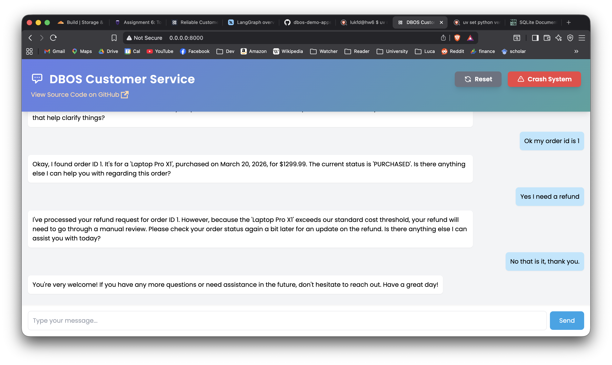

# Assignment 6

By Luca Comba

# Setup

I have mainly followed the tutorial available at [https://docs.dbos.dev/python/examples/customer-service](https://docs.dbos.dev/python/examples/customer-service)

I initialize my local directory and installed the necessary libraries

```bash
uv init --bare
uv add dbos
uv add fastapi
```

I have later decided to use Python 3.14, so I ran `uv python pin 3.14`

I created a `setup.sh` to collect and setup all the necessary environment variables like the AI key.

I copied the `html` folder from the original [git repository](https://github.com/dbos-inc/dbos-demo-apps/blob/main/python/reliable-refunds-langchain/migrations/reset_database.py) so that I could create the database.

# Conversion to Gemini and Sqlite

Because of personal preferences, I have decided to convert the project to use sqlite and Google Gemini.

I have copied and pasted my Gemini key in the `setup.py` and installed some additional packages

- `uv add langgraph-checkpoint-sqlite` 
- `uv add langchain-google-genai`

My local Gemini was able to help me convert the project to use sqlite and langchain-google-genai (the full conversation is available)

Gemini was able to convert the db.py (which was the reset_database.py to use sqlite.

I have also added the ability to start the server by running the `app.py` directly.

# Testing

I was able to create the database and start the FastAPI server.

```
source setup.sh
uv run db.py
uv run app.py
```

After the initial chat, I was receiving messages from Gemini and some of the messages got corrupted due to the incorrect decoding by the api endpoint. 

```
Gemini: I can help you look up your orders, but I'll need an order ID. Do you have that handy?
User: No I don't know them
Gemini: [object Object]
```

So Gemini was able to fix it by rendering correctly the dictionary response from Gemini, probably because it was not accounted for.

I thought it was very curious to see the Gemini response when it was not parsed correctly.

```
[{'type': 'text', 'text': "Okay, I'll explain it again, simply.\n\nMy main functions are:\n\n1. **Look up an order:** If you give me the **order ID number** (it's usually a unique number for each purchase), I can find the details for that specific order.\n2. **Process a refund:** If you have an **order ID number** for something you want to return, I can help you get your money back for that particular item.\n\nI cannot see a general list of all your orders. I need you to provide me with an **order ID** for me to do anything.\n\nIs that clearer?", 'extras': {'signature': 'CuIBAb4+9vvAjp9RuYtUejCGjp4rz+jZ+l/Iwvhxz4GVdApk0aBw/1I2EiWvEilkIep6ZweEb3Ycnxj0CcG6UCuz/ATIXGZCu20c5Wiir+qznLKXieBKc/0TAp9b5MEADmEKufE8bEGhEXEzYS069id2NVpkyjte9Yun2kIsKY7UWys6Xo5bdYQNM9OeYgJhi80cqCWZXPbAssazAv/m7dwvZwoXmQmAHk79yFpJVTqUFQsBN20hJzDZbz8AZNxnmSyIU1okcWR/2odASsagYbRdtSpjxNpIoO3IzHpoLhuf5Ak1zQ=='}}]
```

The DBOS Customer service finally worked correctly.



# Gemini Help

I have exported the entire conversation I had with Google Gemini as it helped me debug the code and better understand the code base.

